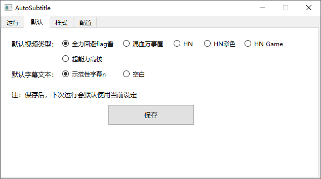

# AutoSubtitle
> 基于opencv，根据视频原字幕生成对帧的ass字幕文件，并识别出固定的说话人。
> 
> 目前仅对YouTube频道`全力回避フラグちゃん`和`混血のカレコレ`做针对性适配，不具备泛用性。

[](https://github.com/Echoosx/AutoSubtitle/releases/latest)
[](https://github.com/Echoosx/AutoSubtitle/tree/master/.github/workflows/pyInstaller.yml)
[](https://space.bilibili.com/28968096/)

## 安装
下载`AutoSubtitle.zip`并解压 ，双击`AutoSubtitle.exe`文件即可运行

使用前请安装`fonts`文件夹下的字体

## 功能
### 一、 自动打轴
1. 选择或拖拽要打轴的视频到位置【1】
2. 选择要识别的视频类型（全力回避flag酱/混血万事屋） 
3. 勾选是否使用新OP类型（仅全力回避flag酱适用） 
4. 点击“开始打轴”按钮，程序开始运行

注：生成的字幕文件默认保存在视频同目录下，名称默认与视频相同。可以在位置【2】进行更改


### 二、 保存默认配置
- 程序启动后的默认视频类型可以选择`全力回避flag酱`或`混血万事屋`
- 生成的字幕文本可以选择`示范性字幕n`或`空白`

注：调试环境下选用`示范性字幕n`更方便观察字幕变化，生产环境下选用`空白`更方便后期填写翻译



### 三、 自定义样式库（非必要不修改）
可以对两种视频类型生成字幕的默认样式库进行修改

选择ass格式的字幕文件，点击保存即可


### 四、 自定义说话人与样式名的对照（非必要不修改）
本功能为功能三的附属

如果在功能三中更改的样式库，样式名与默认样式库不同。可以在此编辑框中修改`说话人`与`样式名`的对照关系

请遵循以下格式修改：
```
说话人 = 样式名
```

注：`说话人`不能更改，`样式名`可以更改。修改不正确可能会导致打轴失败，请谨慎操作。
点击`重置`可恢复默认对照表


## TODO
- [ ] flag酱&混血万事屋 偶尔识别不到OP结尾，导致打轴中断
- [ ] 短字幕漏轴问题
- [ ] `fadein`和`fadeout`样式识别不准确
- [ ] 混血万事屋 新版OP适配
- [ ] 混血万事屋 旧版样式适配
- [ ] 运行自动安装字体