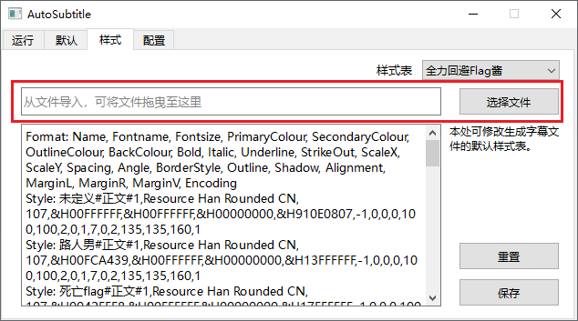
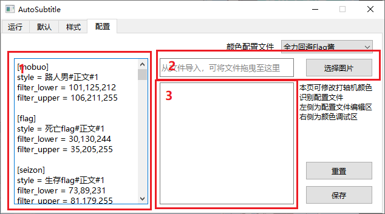

# AutoSubtitle
> 基于opencv，根据视频原字幕生成对帧的ass字幕文件，并识别出固定的说话人。
> 
> 目前对YouTube频道`全力回避フラグちゃん`、`混血のカレコレ`、`ハンドレッドノート`、`私立パラの丸高校`做针对性适配，泛用性较低。

[](https://github.com/Echoosx/AutoSubtitle/releases/latest)
[](https://github.com/Echoosx/AutoSubtitle/tree/master/.github/workflows/pyInstaller.yml)
[](https://space.bilibili.com/28968096/)

## 安装
下载`AutoSubtitle.zip`并解压 ，双击`AutoSubtitle.exe`文件即可运行

使用前请安装`fonts`文件夹下的字体

## 功能
### 一、 自动打轴
1. 选择或拖拽要打轴的视频到位置【1】。
2. 选择要识别的视频类型。
3. 选择OP类型（仅全力回避flag酱适用） 。
4. 点击“开始打轴”按钮，程序开始运行。

注：生成的字幕文件默认保存在视频同目录下，名称默认与视频相同。可以在位置【2】进行更改。


### 二、 保存默认配置
- 程序启动后的默认视频类型可修改。
- 生成的字幕文本可以选择`示范性字幕n`或`空白`。

注：调试环境下选用`示范性字幕n`更方便观察字幕变化，生产环境下选用`空白`更方便后期填写翻译。


### 三、 自定义样式表（高级功能）
可以对各视频类型生成字幕的默认样式表进行修改。

在右上角选择栏选定要修改的样式表，之后选择ass格式的字幕文件，点击保存即可。

允许手动修改，但不推荐如此做。



### 四、 自定义颜色识别（高级功能）
本栏提供自定义颜色识别。

1. 将要识别的字幕所在帧的完整图片在【2】处导入，图片分辨率必须是1920×1080，可以通过在Aegisub中右键视频区域 - “储存PNG截图（不带字幕）”获取。
2. 弹出的窗口中，拖动6个滑动条，直到在数值范围尽可能小的同时下方区域中只显示你需要的颜色，按任意键保存结果，结果会显示在【3】中。
3. 将获得的结果在左侧【1】处按以下样例填写，之后保存：
```
[cyan] ;内部名称，不能重复
style = 青蓝#正文#1 ;样式名称，和样式表一致
filter_lower = 101,43,204 ;从上一步复制
filter_upper = 117,149,255 ;从上一步复制
disabled = 0 ;如果想关闭某一规则请把此项目设置为1，不需要就删掉这行
```
提示与注意事项：
- 本规则针对特定颜色以及渐变色识别可能效果很差。
- 不推荐添加过多不常用的颜色，可能会降低识别准确率。
- 可以通过修改此规则来一定程度上兼容其他类型视频的样式。




## TODO
- [ ] 混血万事屋 新版OP适配
- [ ] 运行自动安装字体
